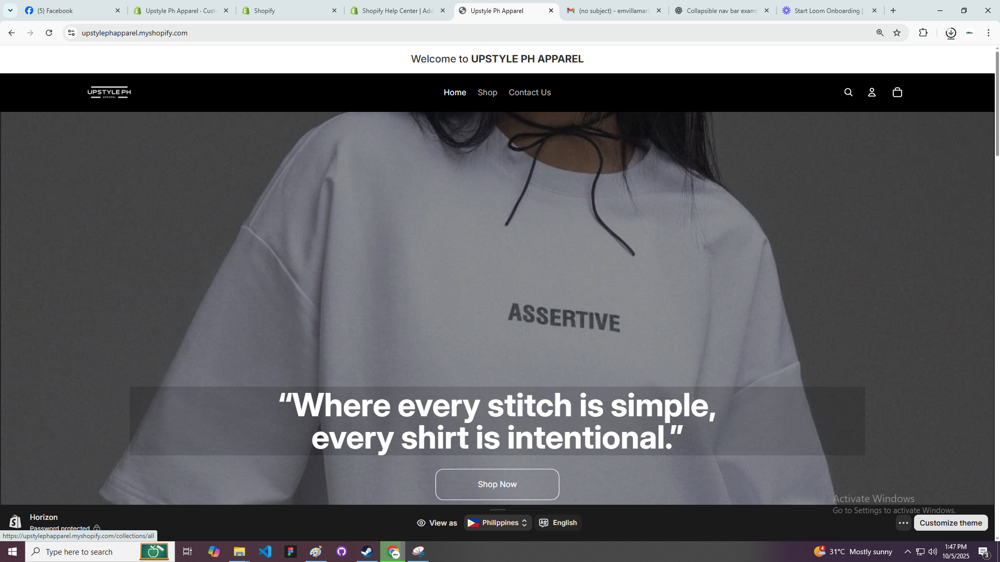
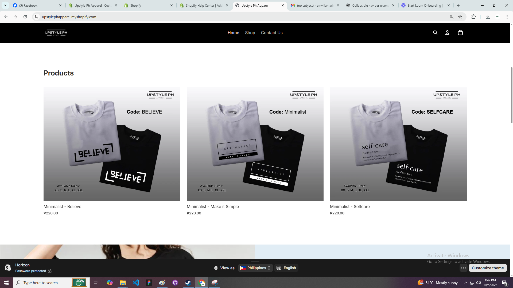
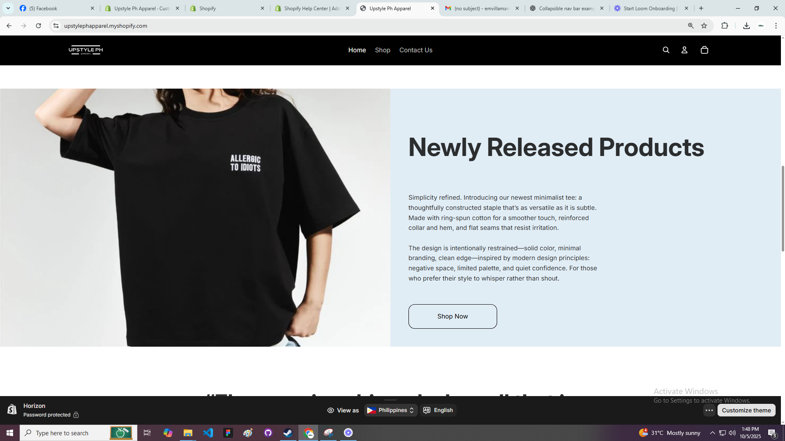

# E-commerce-ShopifyThemeHorizon-Website
Horinzon is a fully responsive, minimalist Shopify theme designed for clean and modern eCommerce stores.
It focuses on simplicity, fast performance, and a seamless shopping experience.

This theme was custom-built using Shopify Liquid, HTML, CSS, and JavaScript, following best practices for Shopify theme development.

✨ Features

      🧩 Built with Shopify Liquid

      📱 Fully Responsive on all devices

      ⚡ Fast-loading and SEO-optimized

      🎨 Clean, minimalist design

      🛒 Customizable product sections

      📦 Dynamic collection and product pages

🛠️ Tech Stack

      Platform: Shopify

      Languages: Liquid, HTML5, CSS3, JavaScript

      Version Control: Git & GitHub

      Deployment/Preview: Shopify Theme Editor

📷 Screenshots

	
	
🔗 Preview

    👉  https://www.loom.com/share/7741746a684d4d1b9b56960340becc9f?sid=8fce9653-a6e4-4295-adb8-ebdae197c1f5
    

🚀 Installation

      To use or customize this theme:
      
      Clone the repository:
      
      git clone https://github.com/evavillamarin/E-commerce-ShopifyTheme-Website.git

Log in to your Shopify Partner Dashboard.

      Go to Online Store → Themes → Add Theme → Upload Zip File.
      
      Zip your theme folder and upload it to Shopify.
      
      Click Customize to edit theme sections.

📦 Folder Structure
    /assets         → CSS, JS, and images  
    /config         → Theme settings schema  
    /layout         → Main theme.liquid  
    /sections       → Homepage and custom section files  
    /snippets       → Reusable components  
    /templates      → Page, product, and collection templates  

💬 Author

EVA MAE VILLAMARIN
📧 emvillamarin09@gmail.com
🌐 evavillamarin

📜 License

This project is for portfolio and educational purposes only.
If you wish to use or modify this theme commercially, please contact the author.
